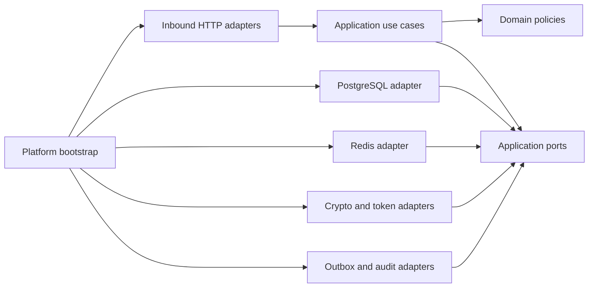

# Identity Service Architecture

## Design Paradigm

Identity is an independently deployable Go application using Clean / Hexagonal Architecture:

```text
HTTP and internal adapters
          ↓
Application commands and queries
          ↓
Domain entities, value objects, and policies
          ↓
Application-owned ports
          ↓
PostgreSQL, Redis, crypto, telemetry, and simulated mail adapters
```

The domain has no dependency on HTTP, PostgreSQL, Redis, Kafka, Kubernetes, OpenTelemetry, or JWT libraries. JWT and persistence details live in adapters behind application ports.

## Inherited Invariants

| Inherited rule | Source | Identity consequence |
|---|---|---|
| Database-per-service | Project blueprint | Identity alone owns `identity_db`. |
| Domain independence | Project blueprint and project context | Authentication policy remains testable without infrastructure. |
| PostgreSQL is durable source of truth | Project blueprint | Users, credentials, sessions, roles, reset tokens, verification tokens, audit, and outbox are durable. |
| Redis is disposable | Project blueprint and project context | Redis failure cannot lose refresh-session or user state. |
| At-least-once integration | Project blueprint | Audit consumers deduplicate by event ID. |
| English project artifacts | Repository governance | All Identity documentation, contracts, code, and operational text are English. |

## Invariants and Rules

### AD-1 — Identity owns authentication state

- **Binds:** users, credentials, sessions, roles, service principals, JWKS publication
- **Prevents:** gateway or business services creating competing identity stores
- **Rule:** only Identity may create or mutate identity state; other services consume tokens, scopes, and safe audit events.

### AD-2 — Access tokens are short-lived asymmetric JWTs

- **Binds:** human and machine access-token issuance and verification
- **Prevents:** shared private keys, long-lived bearer credentials, and symmetric verification secrets across services
- **Rule:** sign with Ed25519/EdDSA, include an explicit `kid`, use separate human and machine audiences, and set a 10-minute default access-token TTL.

### AD-3 — Refresh tokens are durable, opaque, and rotating

- **Binds:** login, refresh, logout, password reset, and session revocation
- **Prevents:** replayable refresh credentials and Redis-only session truth
- **Rule:** return a cryptographically random 256-bit opaque token, store only its SHA-256 hash, rotate it atomically on every refresh, and revoke the session family on reuse.

### AD-4 — Authorization is explicit and layered

- **Binds:** roles, scopes, gateway checks, and business-service use cases
- **Prevents:** an implicit administrator bypass or gateway-only resource authorization
- **Rule:** Identity resolves roles to explicit scopes; the gateway checks coarse scopes; each owning service checks resource ownership and domain permission.

### AD-5 — Security audit is durable before publication

- **Binds:** authentication, session, credential, role, service-token, and revocation events
- **Prevents:** security facts that disappear when Kafka or a relay is unavailable
- **Rule:** write audit state and an outbox record in one Identity PostgreSQL transaction; publish `commerce.security.audit.v1` through the outbox.

### AD-6 — Emergency revocation fails closed

- **Binds:** JTI denylist and protected-token verification
- **Prevents:** a Redis outage silently bypassing an explicit emergency revocation
- **Rule:** if emergency revocation is enabled and the denylist cannot be checked, protected verification returns a dependency-unavailable outcome and the gateway denies the request; refresh-session enforcement remains PostgreSQL-based.

### AD-7 — Private signing keys never leave Identity

- **Binds:** signing, key rotation, JWKS, logs, configuration, and deployment
- **Prevents:** token forgery caused by key leakage or shared private material
- **Rule:** the active private key is available only to Identity through a secret-file or KMS-backed provider; JWKS exposes public material only.

### AD-8 — Public and internal routes have separate trust boundaries

- **Binds:** demo registration, human auth, service-token issuance, and gateway routing
- **Prevents:** anonymous production signup or public access to machine credential exchange
- **Rule:** demo registration is disabled by default; service-token issuance is internal-only and must not be exposed through the public gateway.

### Dependency direction



## Consistency Conventions

| Concern | Convention |
|---|---|
| IDs | UUIDv7 or ULID for external IDs; database UUID primary keys are opaque outside Identity. |
| Time | RFC3339 UTC at boundaries; `TIMESTAMPTZ` in PostgreSQL. |
| Passwords | Argon2id PHC strings; never log or return raw passwords. |
| Refresh/reset/verification tokens | Cryptographically random opaque values; only SHA-256 hashes persisted. |
| Errors | RFC 9457-style Problem Details; generic authentication errors prevent account enumeration. |
| JWT claims | `iss`, `sub`, `aud`, `exp`, `iat`, `jti`, `roles`, `scp`, and optional `nbf`; explicit algorithm and issuer policy. |
| Events | Versioned envelope with event ID, type, aggregate identity, correlation, causation, occurred-at, producer, schema version, and data. |
| Logs | Structured JSON with request, trace, span, correlation, actor, target, and outcome; never credential or token values. |
| Metrics | Low-cardinality labels only: outcome, route, reason class, and role/scope class where bounded. |
| Config | Environment variables or mounted secret references; no secrets in images, source, or ConfigMaps. |

## Component Seed

```text
apps/identity/
├── cmd/api/main.go
├── internal/
│   ├── domain/
│   ├── application/
│   │   ├── command/
│   │   ├── query/
│   │   ├── ports/
│   │   └── dto/
│   ├── adapters/inbound/http/
│   ├── adapters/outbound/
│   │   ├── postgres/
│   │   ├── redis/
│   │   ├── crypto/
│   │   └── mail/
│   └── platform/
└── tests/
    ├── integration/
    └── security/
```

Expected application ports are `UserRepository`, `SessionRepository`, `RoleRepository`, `ServicePrincipalRepository`, `ServiceCredentialRepository`, `AuditRepository`, `OutboxRepository`, `PasswordHasher`, `TokenSigner`, `TokenRevocation`, `RateLimiter`, `Mailer`, `Clock`, and `Transaction`. Interfaces belong beside their consuming use cases.

## Trust and Request Flow

### Human login

1. The client sends credentials over TLS to the gateway/Identity boundary.
2. Identity normalizes the email, loads the user, and verifies Argon2id without revealing account existence.
3. Identity creates a session family and refresh-session row in PostgreSQL.
4. Identity signs a 10-minute human access token and returns it with the opaque refresh token.
5. Identity writes a successful audit record and outbox event in the same local transaction as the session change.

### Refresh

1. Identity hashes the presented refresh token and locks the matching session row or uses a serializable equivalent.
2. An active, unexpired token is marked rotated and linked to a newly created session row.
3. New access and refresh tokens are returned; the old refresh token is never accepted again.
4. A rotated-token reuse attempt revokes every session in the family, records the security action, and returns generic `401 Unauthorized`.

### Token verification

Gateway and services validate the signature using cached JWKS, issuer, audience, expiry, `nbf`, algorithm allowlist, and JTI revocation. JWKS cache refreshes on an unknown `kid` and fails closed when the key cannot be validated.

### Password reset and email verification

Reset and verification requests create one-time hashed tokens with bounded expiry. The simulated mailer receives only a safe delivery command. The API response is generic for reset requests. Password reset invalidates active session families and requires a new login.

### Service-token exchange

An internal caller authenticates an approved service principal using client credentials. Identity verifies an active credential hash, requires every requested scope to be assigned to the principal, and returns `403` without issuing a token when any requested scope exceeds that grant. It signs a short-lived five-minute token for the machine audience. The public gateway never proxies this route.

## Data Model

The detailed relational model is defined in [`docs/design/identity-data-model.md`](../design/identity-data-model.md). The critical transaction boundaries are:

- registration: user + credential + default role + audit/outbox;
- login: session family + session + audit/outbox;
- refresh: old session rotation + replacement session + audit/outbox;
- role mutation: role assignment + audit/outbox;
- user status mutation: status change + active-session revocation when disabling + audit/outbox;
- password reset: credential replacement + session-family revocation + token consumption + audit/outbox.

No transaction spans another service database.

## API and Event Boundaries

- REST source of truth: [`contracts/openapi/identity.openapi.yaml`](../../contracts/openapi/identity.openapi.yaml).
- Kafka source of truth: [`contracts/events/commerce.security.audit.v1.json`](../../contracts/events/commerce.security.audit.v1.json).
- Public gateway routes expose human authentication and user/session operations according to gateway policy.
- `/.well-known/jwks.json` is public read-only key discovery.
- `/.well-known/register` is disabled unless demo mode is explicitly enabled.
- `/v1/auth/service-token` is internal-only.
- `/health/live`, `/health/ready`, `/health/startup`, and `/metrics` are operational endpoints and do not require bearer authentication.

## Failure and Recovery Rules

| Failure | Required behavior |
|---|---|
| PostgreSQL unavailable | Fail readiness and return dependency-unavailable; never issue a durable session without its row. |
| Redis unavailable during credential issuance | Login, demo registration, password-reset request, and service-token issuance fail closed with dependency-unavailable; no credential state is changed. |
| Redis unavailable during refresh/logout | PostgreSQL preserves session correctness; rate-limit or denylist degradation remains observable. |
| Redis unavailable during JTI verification | Deny protected access while emergency revocation is enabled. |
| Redis unavailable during refresh | Refresh remains PostgreSQL-correct; rate-limit behavior is explicit and observable. |
| Kafka unavailable | Commit audit and outbox locally; relay retries with bounded backoff. |
| Outbox relay crash after publish | Permit duplicate audit event publication; consumers deduplicate by event ID. |
| Unknown JWT `kid` | Refresh JWKS once, then return unauthorized if the key remains unknown. |
| Concurrent refresh | Serialize the token-family transition so only one request succeeds. |
| Rotated refresh-token reuse | Revoke the entire family and emit an audit event. |
| Key provider unavailable | Fail readiness and do not issue new tokens; serve only a validated cached public-key snapshot for verification, otherwise return dependency-unavailable. |
| Simulated mailer unavailable | Persist token state and retry delivery; do not expose the token through the API. |

## Observability

Required metrics include:

- `identity_http_requests_total{route,method,status}`;
- `identity_authentication_total{outcome}`;
- `identity_refresh_total{outcome}`;
- `identity_refresh_reuse_total`;
- `identity_sessions_revoked_total{reason}`;
- `identity_jwt_verification_total{outcome}`;
- `identity_rate_limited_total{route}`;
- `identity_outbox_backlog`;
- `identity_outbox_publish_total{outcome}`;
- `identity_db_pool_in_use` and `identity_db_pool_wait_count`.

Logs must include a correlation ID and outcome class. Traces cover HTTP, password verification, database transaction, session transition, audit outbox insert, and relay publication. Token values, password material, reset tokens, and private keys are prohibited in logs and span attributes.

## Production Deployment Seed

The service is deployed as a non-root container with:

- multi-stage static Go build;
- read-only root filesystem where compatible;
- explicit CPU/memory requests and limits;
- Kubernetes Secret or external secret reference for database, Redis, and signing-key configuration;
- `/health/live`, `/health/ready`, and startup probe;
- graceful shutdown with bounded HTTP and database drain;
- NetworkPolicy allowing only required gateway, database, Redis, telemetry, and broker paths;
- PodDisruptionBudget and one-replica-safe local profile;
- migration job or controlled migration command with expand/migrate/contract compatibility;
- structured logs to the platform collector and OTLP traces/metrics;
- no public exposure of PostgreSQL, Redis, or the service-token route.

Docker Compose and Helm values must use the same environment variable names and secret-reference contract. Production-like values must never contain real credentials.

## Capability to Architecture Map

| Capability | Primary location | Governing rule |
|---|---|---|
| User registration and credentials | `domain`, `application/command`, PostgreSQL adapter | AD-1, AD-8 |
| Login and access tokens | `authenticate` use case, crypto adapter | AD-2, AD-7 |
| Refresh rotation | `refresh_session` use case, PostgreSQL transaction | AD-3 |
| Revocation and logout | session use cases, Redis adapter | AD-3, AD-6 |
| RBAC and scopes | role catalog, authorization policy | AD-4 |
| Service tokens | service-token use case, internal HTTP adapter | AD-2, AD-8 |
| Security audit | audit repository, outbox relay, Kafka contract | AD-5 |
| Runtime operations | platform config/server/telemetry | inherited reliability and security rules |

## Deferred

- Cloud KMS/HSM provider selection is deferred behind the token-signing port; local development uses a mounted secret-file provider.
- External identity federation and WebAuthn are outside v1.
- Multi-region identity replication and cross-region session consistency are outside the portfolio deployment.
- Hosted audit retention, legal hold, and operator access policy require a deployment-specific decision before production use.
