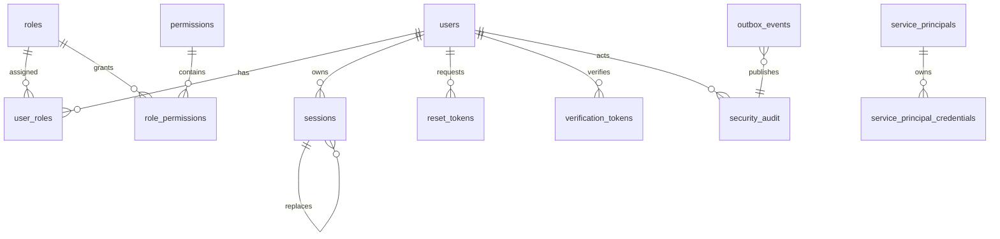

# Identity Service Data Model

## Ownership

All tables in this document belong exclusively to `identity_db`. Other services must use the Identity API, JWKS, or versioned security audit events; they must never query these tables directly.

## Relational Model

## Tables and Constraints

### `users`

| Column | Rule |
|---|---|
| `id` | UUIDv7 primary key. |
| `email` | Original display form; never used for equality. |
| `email_normalized` | Lowercase, trimmed canonical value with a unique constraint. |
| `password_hash` | Argon2id PHC string; never nullable for password users. |
| `status` | `ACTIVE`, `DISABLED`, or `PENDING_VERIFICATION`. |
| `email_verified_at` | Nullable UTC timestamp. |
| `created_at`, `updated_at` | UTC timestamps. |

### `roles`, `permissions`, `role_permissions`, and `user_roles`

- Role and permission names are unique and immutable identifiers.
- `role_permissions` has a composite primary key `(role_id, permission_id)`.
- `user_roles` has a composite primary key `(user_id, role_id)` and records `assigned_at` and `assigned_by`.
- Deleting a role is restricted when it is assigned; deactivation is preferred over destructive deletion.

### `sessions`

| Column | Rule |
|---|---|
| `id` | UUIDv7 primary key. |
| `family_id` | UUID identifying the refresh-token family; indexed. |
| `user_id` | Foreign key to `users`; indexed. |
| `refresh_token_hash` | SHA-256 digest with a unique constraint. |
| `status` | `ACTIVE`, `ROTATED`, or `REVOKED`. |
| `expires_at` | UTC timestamp; default lifetime is 30 days. |
| `revoked_at`, `revoked_reason` | Nullable revocation metadata. |
| `rotated_from_session_id` | Nullable self-reference. |
| `replaced_by_session_id` | Nullable self-reference. |
| `created_at`, `last_used_at` | UTC timestamps. |
| `user_agent_hash`, `ip_prefix_hash` | Optional reduced security metadata; never raw network identity. |

Refresh rotation must use a transaction and a row lock or equivalent serializable guard. The unique hash constraint is a final duplicate-safety boundary, not the complete concurrency policy.

### `reset_tokens` and `verification_tokens`

Each token table contains:

- UUIDv7 `id`;
- `user_id` foreign key;
- unique SHA-256 `token_hash`;
- `purpose` where applicable;
- `expires_at`;
- nullable `consumed_at`;
- `created_at`.

Tokens are single-use. Consumption and the associated state mutation occur in one transaction.

### `service_principals`

| Column | Rule |
|---|---|
| `id` | UUIDv7 primary key. |
| `client_id` | Unique non-secret identifier. |
| `status` | `ACTIVE` or `DISABLED`. |
| `scopes` | Explicit bounded machine scopes in JSONB or normalized relation. |
| `audience` | Dedicated machine audience. |
| `created_at`, `updated_at`, `last_used_at` | UTC timestamps. |

### `service_principal_credentials`

| Column | Rule |
|---|---|
| `id` | UUIDv7 primary key. |
| `service_principal_id` | Foreign key to `service_principals`. |
| `secret_hash` | Argon2id or equivalent approved password-grade hash; never raw. |
| `status` | `ACTIVE` or `RETIRED`. |
| `valid_from`, `retired_at` | UTC timestamps defining the credential validity window. |
| `created_at`, `last_used_at` | UTC timestamps. |

Credentials are provisioned out-of-band and are never returned by an API. A bounded rotation may keep one replacement credential active alongside the previous credential; at most two credentials are active for a principal during the overlap window, after which the old credential is retired.

### `security_audit`

| Column | Rule |
|---|---|
| `id` | UUIDv7 primary key and event ID. |
| `actor_id`, `actor_type` | Nullable for failed anonymous attempts; safe identity only. |
| `action` | Bounded action code such as `login.succeeded` or `role.assigned`. |
| `target_type`, `target_id` | Nullable safe target identity. |
| `metadata` | Sanitized JSONB with no secrets or raw credentials. |
| `correlation_id` | Request/workflow correlation identifier. |
| `occurred_at` | UTC timestamp. |

### `outbox_events`

| Column | Rule |
|---|---|
| `id` | UUIDv7 primary key and event ID. |
| `event_type` | `commerce.security.audit.v1`. |
| `aggregate_type`, `aggregate_id` | Audit aggregate identity. |
| `payload` | Complete versioned event envelope as JSONB. |
| `headers` | Safe correlation and causation metadata. |
| `created_at` | UTC timestamp. |
| `published_at` | Nullable UTC timestamp. |
| `attempts` | Non-negative retry count. |
| `last_error` | Sanitized operational error class, never secrets. |

The outbox relay claims rows with `FOR UPDATE SKIP LOCKED`, publishes to Kafka, and marks them published. A crash after publication may produce a duplicate.

## Migration Rules

- Migrations live under `database/identity/migrations/`.
- SQL queries live under `database/identity/queries/`.
- Migrations are append-only after merge.
- Destructive changes follow expand → migrate → contract.
- Every migration has an upgrade test and a rollback/recovery note where rollback is meaningful.
- Seed role/permission data is idempotent and versioned with the migration that introduces it.

## Retention and Privacy

- Expired refresh sessions and one-time tokens are cleaned by an idempotent maintenance job.
- Audit retention is configurable by deployment and must be finalized before a hosted deployment.
- Raw passwords, tokens, private keys, and full IP addresses are never stored.
