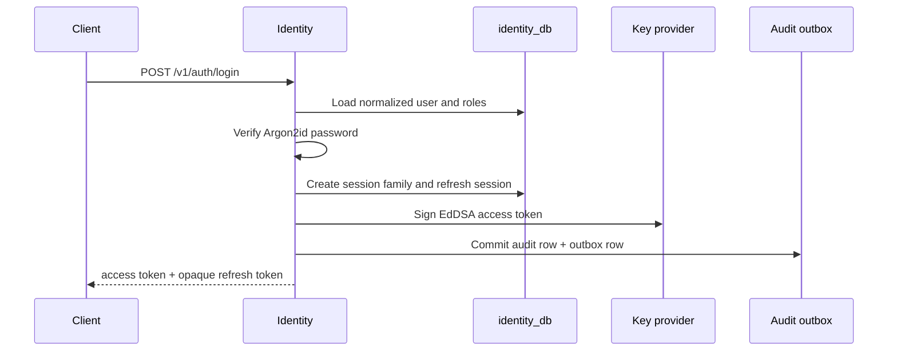
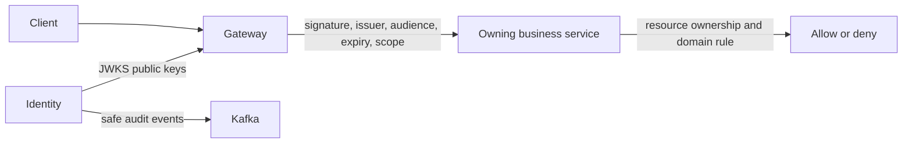

# Identity Service Flows

## Human Login



## Refresh Rotation and Reuse

```mermaid
sequenceDiagram
  participant C as Client
  participant I as Identity
  participant DB as identity_db

  C->>I: POST /v1/auth/refresh
  I->>I: SHA-256 presented token
  I->>DB: Lock matching session
  alt Active and unexpired
    I->>DB: Mark old token rotated; create replacement
    I-->>C: New access token + refresh token
  else Already rotated
    I->>DB: Revoke every session in family
    I-->>C: Generic 401 Unauthorized
  else Revoked or expired
    I-->>C: Generic 401 Unauthorized
  end
```

## Authorization Boundary



The gateway is not the final authorization layer. A customer token with `orders:read:self` cannot read another customer's order unless the Orders use case confirms ownership or an explicit `read:any` scope is present.

## Security Decision Table

| Condition | HTTP outcome | Durable effect |
|---|---:|---|
| Unknown user or wrong password | 401 | Sanitized failed-login audit. |
| Disabled user | 401 | Sanitized failed-login audit. |
| Wrong issuer, audience, algorithm, expiry, or signature | 401 | No session mutation. |
| Authenticated without required scope | 403 | Denied-action audit where policy requires. |
| Valid customer scope but foreign resource | 403 | Business-service denial; Identity is not the resource owner. |
| Rotated refresh token reuse | 401 | Session-family revocation and audit. |
| Redis unavailable during JTI denylist lookup | 503/deny at gateway | No durable identity loss. |
| PostgreSQL unavailable | 503 | No token/session issuance. |
| Reset request for unknown email | 202 | No account-existence disclosure. |
