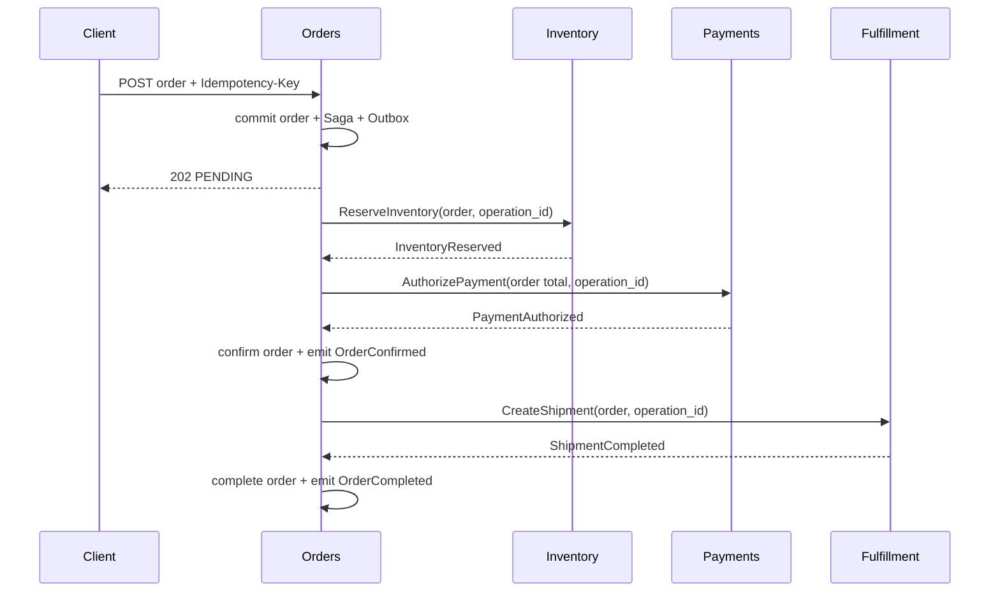

# Orders Saga Design

## Happy path

## Step policy

| Step | Command | Success fact | Transient failure | Permanent failure |
|---|---|---|---|---|
| Inventory | `ReserveInventory` | `InventoryReserved` | bounded retry | `InventoryRejected` → `FAILED` |
| Payment | `AuthorizePayment` | `PaymentAuthorized` | bounded retry | `PaymentFailed` → release inventory → `FAILED` |
| Fulfillment | `CreateShipment` | `ShipmentCreated`/`ShipmentCompleted` | bounded retry | refund payment → release inventory → `FAILED` |

Commands are written to Outbox only after the preceding local transition commits. A relay may publish duplicates; downstream operation IDs make them harmless.

When `PaymentAuthorized` is received, Orders verifies that the authorized amount and currency exactly match the immutable order quote. A mismatch is quarantined as a contract/integrity failure, prevents confirmation, and starts the documented compensation path; Orders never silently accepts a partial or differently denominated authorization.

## Compensation

Compensation is a first-class Saga phase, not an error log. Each compensation command has its own persisted step, attempt count, deadline, and operation ID. If payment was authorized, `RefundPayment` is required before terminal cancellation/failure unless Payments confirms it was never captured. If a compensation step fails after its retry budget, the public order may be `FAILED` but internal Saga state becomes `FAILED_REQUIRES_REVIEW`, which pages an operator.

## Timeouts and ambiguous outcomes

A timeout means “unknown,” not “failed.” Orders retries the same deterministic operation and reconciles through the private lookup contract in [`orders-reconciliation.md`](orders-reconciliation.md) when needed. It never generates a fresh operation ID blindly after a timeout.

## Repair

Authorized repair replays a quarantined event or resumes a named Saga step after checking current order, Inbox, Outbox, and downstream operation state. Repair commands are audited, rate-limited, and cannot force arbitrary public status changes.
